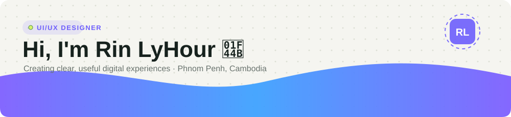

<!-- Banner: follows the visitor's GitHub light/dark theme -->
<picture>
  <source media="(prefers-color-scheme: dark)" srcset="./assets/banner-dark.svg">
  
</picture>

  

<h1 align="center">Hey, I'm Rin LyHour!</h1>

  

  
  
  
  

  

---

## 🚀 About Me

I'm a **UI/UX designer** based in **Phnom Penh, Cambodia** who creates clear, useful digital experiences — from user flows and wireframes to polished prototypes and design systems. I also build what I design, so my handoffs come from someone who knows how the code works.

- 🎨 Focus: **Wireframing · Prototyping · User Flow · Design Systems**
- 💻 Also build with **React, Laravel, Flutter, Spring Boot**
- 📫 Reach me: **rinlyhour9@gmail.com**

## 🎨 Design Tools

  
  
  
  
  
  

## 💻 Tech Stack

  
  
  
  
  
  
  
  
  
  
  
  
  
  
  

## 🌱 What I'm Improving

<picture>
  <source media="(prefers-color-scheme: dark)" srcset="./assets/improving-dark.svg">
  
</picture>

## 📊 GitHub Stats

  
  

  

---

  

