<!-- Cards are generated by tools/generate.py — edit the data there and re-run -->
<picture>
  <source media="(prefers-color-scheme: dark)" srcset="./assets/banner-dark.svg">
  
</picture>

  

  

  <a href="mailto:rinlyhour9@gmail.com"><picture>  <source media="(prefers-color-scheme: dark)" srcset="./assets/buttons/email-dark.svg">  </picture></a>
  <a href="https://portfolio-rinlyhour.vercel.app/"><picture>  <source media="(prefers-color-scheme: dark)" srcset="./assets/buttons/portfolio-dark.svg">  </picture></a>
  <a href="https://t.me/LyyHourRinn"><picture>  <source media="(prefers-color-scheme: dark)" srcset="./assets/buttons/telegram-dark.svg">  </picture></a>
  <a href="https://portfolio-rinlyhour.vercel.app/file/RINLYHOUR_RESUME.pdf"><picture>  <source media="(prefers-color-scheme: dark)" srcset="./assets/buttons/resume-dark.svg">  </picture></a>

  

 

<picture>
  <source media="(prefers-color-scheme: dark)" srcset="./assets/about-dark.svg">
  
</picture>

 

<picture>
  <source media="(prefers-color-scheme: dark)" srcset="./assets/toolkit-dark.svg">
  
</picture>

 

<picture>
  <source media="(prefers-color-scheme: dark)" srcset="./assets/improving-dark.svg">
  
</picture>

 

## 📊 GitHub Stats

  
  

  

---

  

